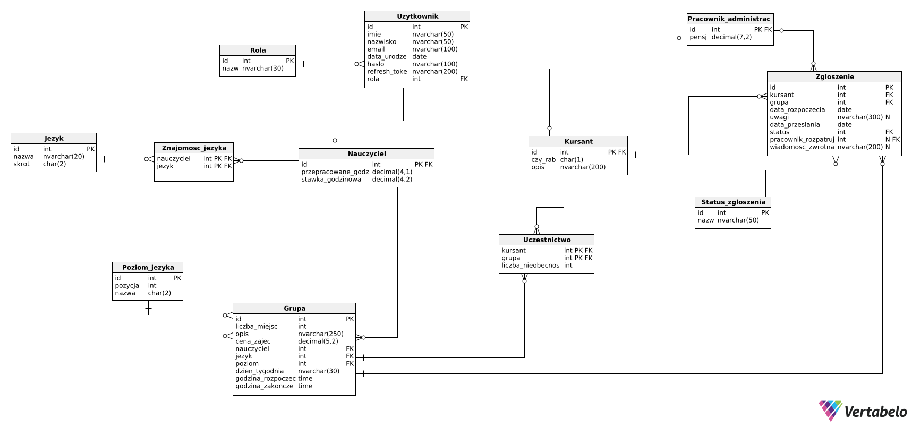

# Temat
Tematem projektu jest Szkoła Językowa "Inglisz", przyjmująca zapisy do grup przez zarejestrowanych użytkowników oraz zarządzanie tymi grupami. Zajęcia w grupach odbywają się tylko raz w tygodniu o określonych godzinach.

# Zakres
- logowanie
- rejestracja
- zgłaszanie się przez zarejestrowanego użytkownika na zajęcia
- rozpatrywanie zgłoszeń przez pracownika administracyjnego z informacją zwrotną
- edycja zgłoszenia jeśli nie zostało jeszcze rozpatrzone
- wycofanie zgłoszenia
- dodawanie nowych grup przez pracownika administracyjnego
- edycja grupy
- usunięcie grupy

# Model danych
## Diagram związków encji

## Opis tabel
### Uzytkownik:
Encja na wszystkich użytkowników aplikacji. Traktujemy ją jako bazę do encji `nauczyciel`, `pracownik_administracyjny` i `kursant`. Rozróżnienie odbywać się będzie za pomocą wartości w polu `rola`

| Nazwa pola    | Typ pola      | Opis pola                                                                                                                                                                                     |
| ------------- | ------------- | --------------------------------------------------------------------------------------------------------------------------------------------------------------------------------------------- |
| id            | int           | klucz główny                                                                                                                                                                                  |
| imie          | nvarchar(50)  | imię użytkownika                                                                                                                                                                              |
| nazwisko      | nvarchar(50)  | nazwisko użytkownika                                                                                                                                                                          |
| email         | nvarchar(100) | adres email użytkownika służący do logowania                                                                                                                                                  |
| rola          | int           | klucz obcy wskazujący na rolę, którą użytkownik pełni w systemie. Niedopuszczalne jest wiele ról dla jednego użytkownika np. kursant nie może być jednocześnie nauczycielem nauczycielem itd. |
| hasło         | nvarchar(50)  | zahashowane hasło użytkownika                                                                                                                                                                 |
| salt          | nvarchar(50)  | sól będąca zabezpieczniem dla hasła użytkownika                                                                                                                                               |
| refresh_token | nvarchar(100) | refresh token do JWT                                                                                                                                                                          |
### Rola:
Tabela przechowująca informacje o rolach w systemie

| Nazwa pola | Typ pola     | Opis pola        |
| ---------- | ------------ | ---------------- |
| id         | int          | klucz główny     |
| nazwa      | nvarchar(30) | nazwa danej roli |

### Nauczyciel:
Nauczyciele to osoby przypisane do grup zajęciowych i uczące w nich.

| Nazwa pola            | Typ pola     | Opis pola                                                                                   |
| --------------------- | ------------ | ------------------------------------------------------------------------------------------- |
| id                    | int          | klucz główny i obcy z tabeli Uzytkownik                                                     |
| stawka_godzinowa      | decimal(4,2) | określa wysokość stawki godzinowej danego nauczyciele                                       |
| przepracowane_godziny | decimal(4,1) | ilość godzin przepracowanych w bieżącym miesiącu. Aktualizacja na początku każdego miesiąca |
### Pracownik_administracyjny:
Pracownik administracyjny to osoby odpowiedzialne za akceptowanie zgłoszeń, tworzenie grup itd.

| Nazwa pola | Typ pola     | Opis pola                                             |
| ---------- | ------------ | ----------------------------------------------------- |
| id         | int          | klucz główny i obcy z tabeli Uzytkownik               |
| pensja     | decimal(7,2) | pensja miesięczna danego pracownika administracyjnego |
### Kursant:
Domyślnie po rejestracji ktoś staje się kursantem i powinien podać krótki opis dotyczący siebie. Możliwa weryfikacja stacjonarnie, w celu uzyskania zniżki, nadawana przez pracownika administracyjnego.

| Nazwa pola | Typ pola      | Opis pola                                                             |
| ---------- | ------------- | --------------------------------------------------------------------- |
| id         | int           | klucz główny i obcy z tabeli Uzytkownik                               |
| opis       | nvarchar(200) | krótki opis dotyczący siebie o długości max 250 znaków                |
| czy_rabat  | char(1)       | pole określające czy użytkownikowi przysługuje zniżka -10% na zajęcia |
### Status_zgloszenia:
Encja słownikowa na statusy zgłoszeń (np. odrzucone, przyjęte, w oczekiwaniu itd.).

| Nazwa pola | Typ pola     | Opis pola                          |
| ---------- | ------------ | ---------------------------------- |
| id         | int          | klucz główny                       |
| nazwa      | nvarchar(50) | nazwa tego statusu (np. odrzucone) |
### Jezyk:
Encja słownikowa na wszystkie języki nauczane w szkole językowej.

| Nazwa pola | Typ pola     | Opis pola                        |
| ---------- | ------------ | -------------------------------- |
| id         | int          | klucz główny                     |
| skrot      | char(2)      | skrócona nazwa języka np. `en`   |
| nazwa      | nvarchar(20) | pełna nazwa języka np. Angielski |
### Poziom_jezyka:
Encja słownikowa na przechowywanie informacji o poziomach językowych zgodnie z CEFR.

| Nazwa pola | Typ pola      | Opis pola                                                                     |
| ---------- | ------------- | ----------------------------------------------------------------------------- |
| id         | int           | klucz główny                                                                  |
| pozycja    | int           | które miejsce w hierarchii ma dany poziom (np. A1 jest w hierarchii pierwszy) |
| nazwa      | char(2)       | nazwa poziomu np. A1                                                          |
| opis       | nvarchar(300) | opis danego poziomu ze szczegółami                                            |

### Znajomosc_jezyka:
Tabelka asocjacyjna do przechowywania znajomości języków przez nauczycieli szkoły językowej.

| Nazwa pola | Typ pola | Opis pola                                                                               |
| ---------- | -------- | --------------------------------------------------------------------------------------- |
| nauczyciel | int      | klucz obcy wskazujący na nauczyciela, którego rekord dotyczy; cześć klucza głównego     |
| jezyk      | int      | klucz obcy wskazujący na język, którego rekord dotyczy; cześć klucza głównego           |
| poziom     | int      | klucz obcy wskazujący na poziom na jakim dany język jest znany przez danego nauczyciela |
### Grupa:
Tabela przechowująca informację o utworzonych aktualnie grupach w szkole językowej.

| Nazwa pola          | Typ pola      | Opis pola                                                                       |
| ------------------- | ------------- | ------------------------------------------------------------------------------- |
| nr_grupy            | int           | unikalny numer grupy, będący kluczem głównym                                    |
| liczba_miejsc       | int           | max liczba miejsc w grupie                                                      |
| opis                | nvarchar(250) | opis danej grupy (np. czy jest przyjazna dzieciom itd.)                         |
| cena_zajec          | decimal(5,2)  | standardowa cena za jedne zajęcia w tej grupie                                  |
| nauczyciel          | int           | klucz obcy wskazujący na głównego nauczyciela prowadzącego zajęcia w tej grupie |
| jezyk               | int           | klucz obcy wskazujący na język nauczany w tej grupie                            |
| poziom_jezyka       | int           | klucz obcy wskazujący na poziom języka nauczanego w tej grupie                  |
| dzien_tygodnia      | nvarchar(30)  | dzień tygodnia kiedy odbywają się zajęcia                                       |
| godzina_rozpoczecia | time          | czas rozpoczęcia zajęć                                                          |
| godzina_zakonczenia | time          | czas zakończenia zajęć                                                          |

### Zgłoszenie
Tabela przechowująca zgłoszenia przesyłane przez użytkowników.

| Nazwa pola             | Typ pola      | Opis pola                                                                                                                 |
| ---------------------- | ------------- | ------------------------------------------------------------------------------------------------------------------------- |
| id                     | int           | klucz główny                                                                                                              |
| kursant                | int           | klucz obcy wskazujący na kursanta, który to zgłoszenie złożył                                                             |
| grupa                  | int           | klucz obcy wskazujący na grupę, do której jest to zgłoszenie                                                              |
| data_rozpoczęcia       | date          | wprowadzana przez kursanta data w której chciałby rozpocząć zajęcia                                                       |
| data_przeslania        | date          | data generowana automatycznie przez system w momencie otrzymania zgłoszenia                                               |
| status                 | int           | klucz obcy wskazujący na bieżący status zgłoszenia                                                                        |
| pracownik_rozpatrujacy | int           | klucz obcy wskazujący na pracownika, który rozpatruje to zgłoszenie (początkowo puste, po rozpatrzeniu otrzymuje wartość) |
| wiadomosc_zwrotna      | nvarchar(200) | wiadomość zwrotna od pracownika administracyjnego wpisywana w procesie rozpatrywania zgłoszenia (pole nieobowiązkowe)     |
### Uczestnictwo:
Tabelka przechowująca zatwierdzonych uczestników określonych grup

| Nazwa pola          | Typ pola | Opis pola                                                       |
| ------------------- | -------- | --------------------------------------------------------------- |
| kursant             | int      | klucz obcy wskazujący na kursanta, którego ten rekord dotyczy   |
| nr_grupy            | int      | klucz obcy wskazujący na grupę, której ten rekord dotyczy       |
| liczba_nieobecności | int      | liczba nieobecności danego kursanta na zajęciach w danej grupie |
